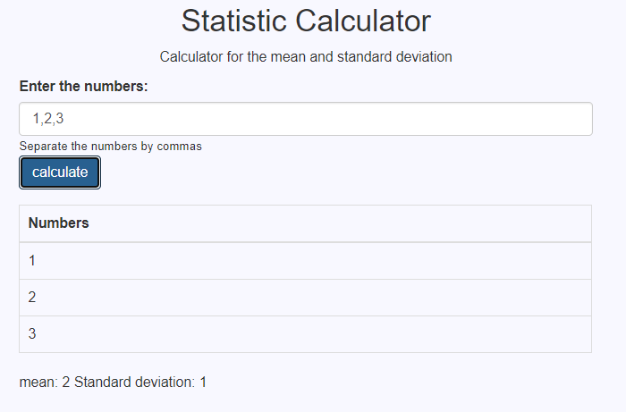

# Statistic Calculator Spark
Web application using Spark that allow calculate the mean and standard deviation of a set of n real numbers that are entered by the user through a web page. The set of the n real numbers are stored in a own linked list implementation.


[](https://app.circleci.com/pipelines/github/juancamilo399/SparkWebMean)

Application deployed in heroku: [here](https://arep-median-spark.herokuapp.com/)


## Getting Started

The following instructions will allow you to have a copy of the project and run it on your machine.

### Prerequisites

* [Maven](https://maven.apache.org/) - Dependency Management
* [Java 8](https://www.oracle.com/co/java/technologies/javase/javase-jdk8-downloads.html) -  Development Environment 
* [Git](https://git-scm.com/) - Version Control System
* [Spark](http://sparkjava.com/) - Micro framework for creating web applications in Java 8

### Installing

1. Clone the repository

```
git clone https://github.com/juancamilo399/SparkWebMean.git
```

2. Compile the projet

```
mvn package
```

3. Executing the program

```
mvn exec:java -D "exec.mainClass"="edu.escuelaing.arep.SparkWebApp"

In your browser: http://localhost:4567
```

To run locally you must change the url assigned to the post method since it is configured with heroku.

You should use this url: http://localhost:4567/calculator/calculate/ instead the heroku url.


To use the application you must enter the numbers separated by comma, pressing the button the numbers typed and their respective mean and standard deviation will be displayed.



4. Generating the documentation

```
mvn javadoc:javadoc
```

The documentation will be generated in target/site/apidocs/index.html.

## Documentation


## Running the tests

To run the unit tests

```
mvn test
```

## Built With

* [Maven](https://maven.apache.org/) - Dependency Management
* [Spark](http://sparkjava.com/) - Micro framework for creating web applications in Java 8
* [Heroku](https://www.heroku.com/platform) - Deploy platform

## Inform


## Author

* **Juan Camilo Angel Hernandez** 


## License

This project is under GNU General Public License - see the [LICENSE](LICENSE) file for details.
